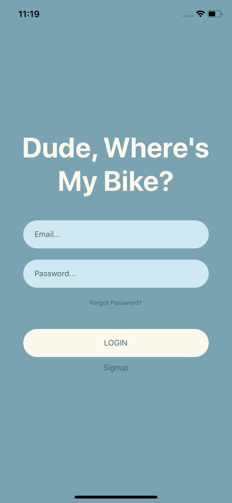

# React Native Mobile App 
## How to run
1. [Set up react-native development environment](https://reactnative.dev/docs/environment-setup)
2. run `npx react-native start`
3. run `npx react-native run-ios` or `npx react-native run-android` in another terminal
## Special Environment Configurations
* disabled flipper in ios/Podfile -- Maegan doesn't update macOS and can't run the iOS emmulator :')
## Color Palate 
    Open to change, but followed this [one](https://colorhunt.co/palette/226680)
## Screens
    Login Screen
    
