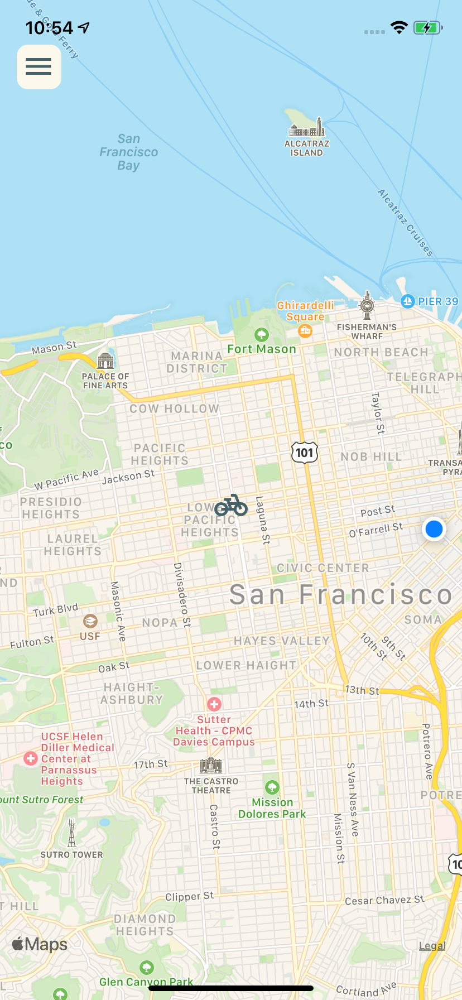
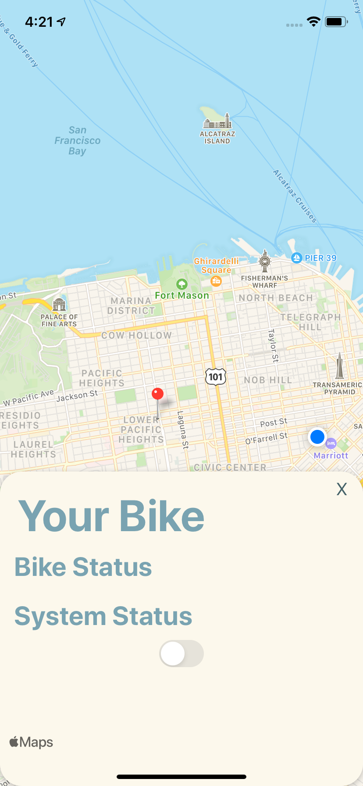
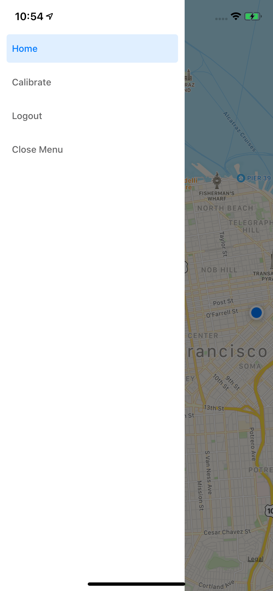
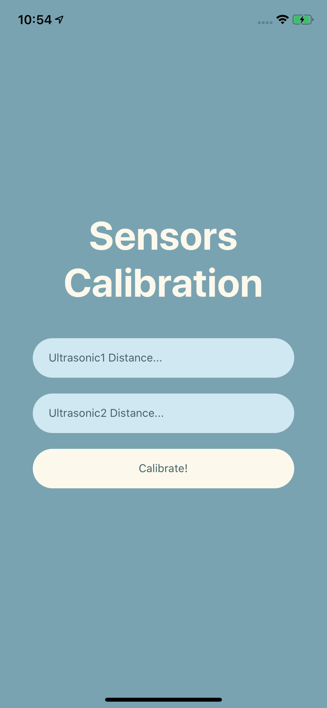

# React Native Mobile App 
## How to run
1. [Set up react-native development environment](https://reactnative.dev/docs/environment-setup)
2. run `npx react-native start`
3. run `npx react-native run-ios` or `npx react-native run-android` in another terminal
## Test Map Updates with MQTT Locally
1. install mosquitto using homebrew with `brew install mosquitto`
2. go to the map homepage, bike default location is at EEB
3. run `mosquitto_pub -h test.mosquitto.org -t DudeWheresMyBike -m "{\"latitude\": \"40.75773\", \"longitude\": \"-73.985708\" }"`
4. bike should now update to Times Square!
5. run `mosquitto_pub -h test.mosquitto.org -t DudeWheresMyBike -m "{\"latitude\": \"34.0255432129\", \"longitude\": \"-118.2840957642\" }"` for bike to move to the USC Village!
## Special Environment Configurations
* disabled flipper in ios/Podfile -- Maegan doesn't update macOS and can't run the iOS emmulator :')
## Color Palate 
   Open to change, but followed this [one](https://colorhunt.co/palette/226680)
## Screens
   Login Screen
    
   
    
   Map Home Screen
    
   
    
   Bike Status (Get here by pressing on bike)
    
   
    
   Menu
    
   
    
   Calibration
    
   
    